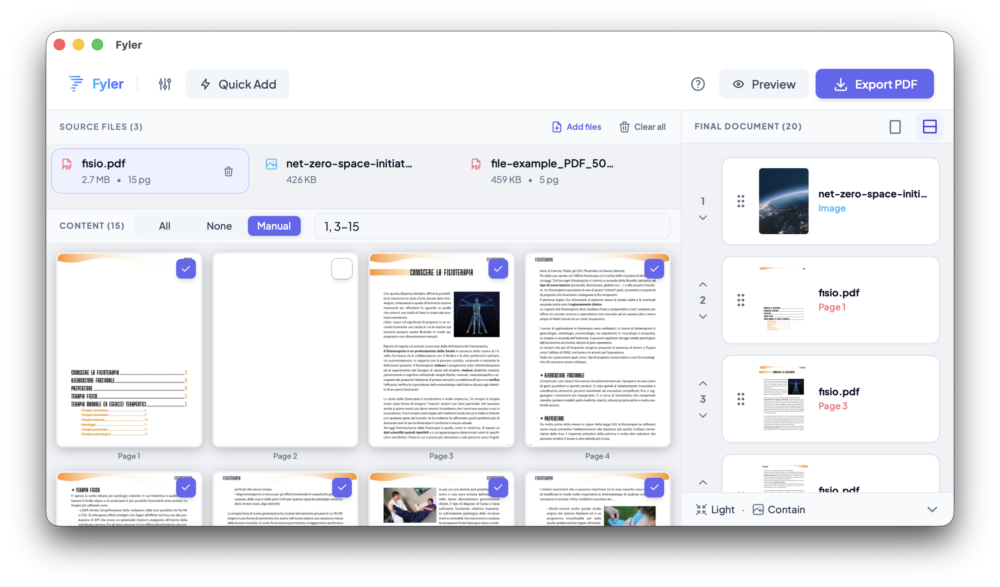
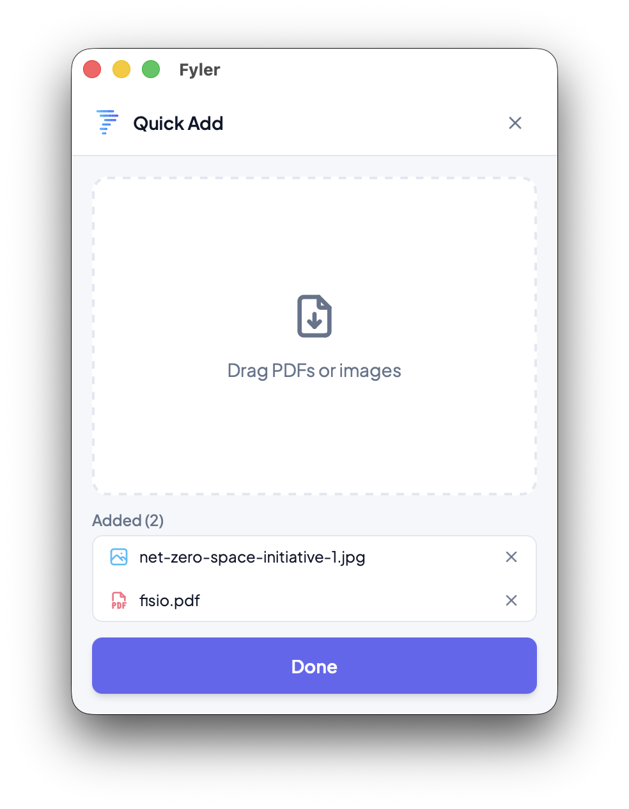

# Fyler


Desktop app for merging PDF files and images into a single PDF, built with Tauri 2.



## Features

- Add PDF files and images (JPG, PNG, WebP, and more)
- Reorder content via drag & drop
- Select specific page ranges per document (e.g. `1-3,5,8`)
- Rotate individual pages directly from the preview
- Preview any document before exporting
- Export a single merged PDF
- Optimize output: JPEG image compression and layout-aware image downscaling
- Light / dark mode with persistent preference

## Quick Add

<table>
  <tr>
    <td valign="top" width="58%">
      <p><strong>Quick Add</strong> opens a compact, always-on-top window for fast file collection.</p>
      <p>Drag PDFs or images into it, review the files you just added, remove anything you do not want, then return to the main workspace when ready.</p>
    </td>
    <td valign="top" width="42%" align="center">
      
    </td>
  </tr>
</table>

## Downloads

Prebuilt desktop packages are published on the
[GitHub Releases page](https://github.com/gualask/fyler/releases).

Current release targets:

- macOS Apple Silicon
- macOS Intel
- Windows
- Linux

## Getting started

**Prerequisites:** [Rust](https://rustup.rs), [Node.js](https://nodejs.org), [pnpm](https://pnpm.io)

Start the desktop app in development mode:

```bash
pnpm install
pnpm tauri:dev
```

Build the production desktop bundle:

```bash
pnpm tauri:build
```

## Dev Fixtures

This project supports small, dev-only fixture pages under `src/dev/` so complex UI states can be
inspected in a normal browser session without mounting the live Tauri backend.

Use them when you need a deterministic way to inspect DOM structure, layout, and component behavior
with Playwright or manual debugging.

Conventions:

- keep fixtures under `src/dev/`
- register fixtures in `src/dev/index.tsx`
- expose them through the `dev` query-string parameter
- keep names minimal and scenario-based
- keep fixtures isolated from Tauri dependencies when the goal is layout or DOM inspection

Routes:

- `?dev=fixtures` opens the fixture index
- `?dev=runtime-app` mounts the real app shell with the dev browser-safe platform adapter
- `?dev=workspace-shell` opens the technical browser-safe workspace shell baseline, not a representative working-session view
- `?dev=workspace-empty` opens the empty-state workspace fixture
- `?dev=preview-modal` opens the browser-safe preview modal fixture (`&pages=1` for single-page)
- `?dev=quick-add` opens the browser-safe quick-add fixture
- `?dev=support-dialog` opens the support dialog fixture (`&mode=about` for about mode)
- `?dev=tutorial-overlay` opens the tutorial overlay fixture (`&step=0..3` to inspect targets)
- `?dev=feedback-overlays` opens feedback overlay fixtures (`&view=progress`, `progress-indeterminate`, `toast-success`, `toast-warning`)
- `?dev=final-document` opens the populated final-document fixture
- `?dev=page-picker` opens the PDF page-picker fixture (`&mode=image` for the image panel)
- `?dev=update-dialog` opens the update dialog fixture (`&view=installing` or `error` for alternate states)
- `?dev=error-boundary` opens the app error boundary fallback fixture (`&message=...` to override the crash text)

Use:

- `?dev=<fixture>` for isolated UI inspection
- `?dev=runtime-app` for Playwright/browser audit of the real shell without Tauri
- `?dev=workspace-shell` when you only need the static shell frame without selection, preview, or export flows
- `pnpm tauri:dev` for native Tauri and OS-integrated checks

What belongs in git:

- fixture pages in `src/dev/`
- the dev-only browser-safe adapter support under `src/dev/`
- the small gating code needed to open them in development
- reusable mock data that makes the fixture useful

What should stay local:

- Playwright MCP output folders such as `.playwright-mcp/`
- screenshots or dumps created only for temporary inspection

On Linux, Tauri also requires system packages. The release workflow installs:

```bash
sudo apt-get install -y libwebkit2gtk-4.1-dev libappindicator3-dev librsvg2-dev patchelf
```

## Documentation

- [Theming](docs/theming.md)
- [Architecture](docs/architecture.md)
- [PDF export and image handling](docs/pdf-export.md)
- [Performance notes](docs/performance.md)

## License

MIT
