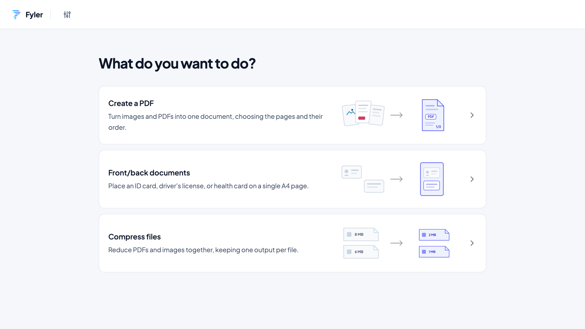
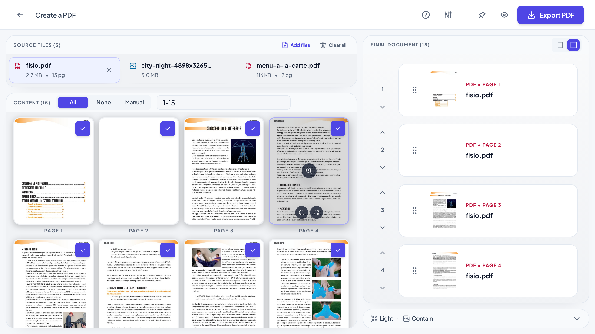
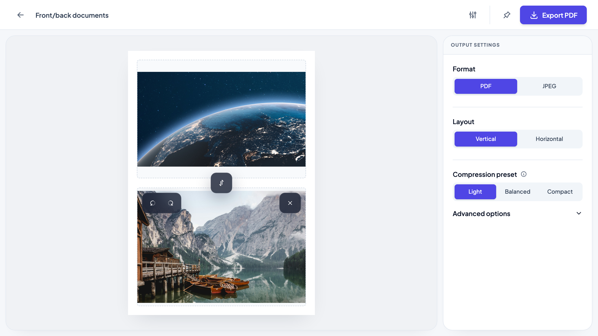
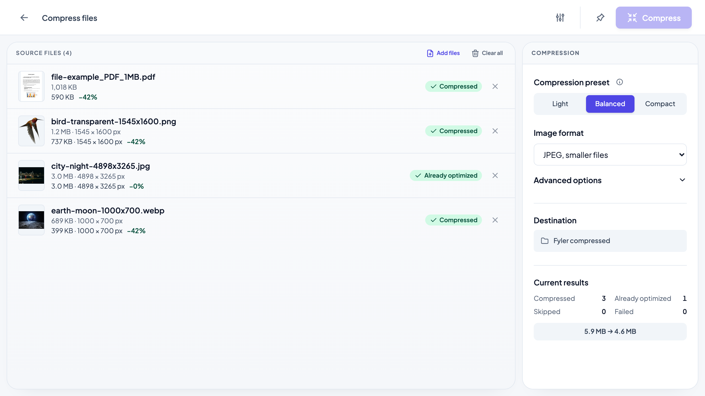

<p align="center">
  
</p>

<p align="center">
  <strong>Local desktop tools for everyday PDF and image work.</strong><br />
  Create documents, arrange front-and-back cards, and compress files without uploading them.
</p>

<p align="center">
  <a href="https://github.com/gualask/fyler/releases/latest"></a>
  <a href="https://github.com/gualask/fyler/actions/workflows/ci.yml"></a>
  <a href="LICENSE"></a>
</p>

Fyler is a focused desktop app for working with local PDFs and images. It provides three guided
workflows instead of a full document editor, so common tasks stay predictable.

Available for macOS, Windows, and Linux.

> [!NOTE]
> Windows release builds are currently unsigned and may trigger Microsoft Defender SmartScreen.
> Download Fyler only from the [official GitHub Releases](https://github.com/gualask/fyler/releases/latest)
> and use the included `SHA256SUMS.txt` file to verify download integrity.

<p align="center">
  
</p>

## What you can do

### Create a PDF

- Combine PDFs and images into one document.
- Import password-protected PDFs by entering their password locally.
- Select full PDFs or exact page ranges such as `1-3,5,8`.
- Reorder, rotate, preview, and remove pages without changing the source files.
- Choose an optimization preset or tune image compression before export.

<p align="center">
  
</p>

### Arrange front-and-back documents

- Place the front and back of an ID card, driver's license, or similar document on one A4 page.
- Use images or one selected page from a PDF for each side.
- Switch between portrait and landscape layouts, rotate sources, and preview the final placement.
- Export the result as PDF or JPEG.

<p align="center">
  
</p>

### Compress files in a batch

- Compress multiple PDFs and images in one run while keeping one output per source file.
- Use shared `Light`, `Balanced`, or `Compact` presets.
- Keep an image's supported source format or convert it to JPEG.
- Review progress, per-file results, skipped inputs, and size savings.

<p align="center">
  
</p>

Fyler is available in English and Italian, with light and dark themes and three accent colors.

## Supported files

The PDF creation and front/back workflows accept PDF, PNG, JPEG, GIF, TIFF, WebP, BMP, ICO, TGA,
and QOI files.

Batch compression supports PDF, JPEG, PNG, static WebP, and BMP. Password-protected or digitally
signed PDFs and animated WebP files are reported as skipped instead of being modified.

## Privacy

Document processing happens on your device. Fyler does not upload your files to a Fyler service.
Release builds check GitHub Releases for updates when the app starts, and the in-app support flow
opens GitHub only when you ask it to. See the [privacy notes](PRIVACY.md) for details.

<details>
<summary>Build from source</summary>

See [Contributing](CONTRIBUTING.md) for platform prerequisites and the complete verification
workflow. After installing the prerequisites:

```bash
corepack enable
pnpm install
pnpm tauri:dev
```

Build a production desktop bundle with:

```bash
pnpm tauri:build
```

On Windows, build the standalone executable with:

```bash
pnpm tauri:build:standalone
```

The standalone output uses `src-tauri/target/standalone` and disables the updater.

</details>

## Documentation

For users:

- [Changelog](CHANGELOG.md)
- [Privacy](PRIVACY.md)
- [Security policy](SECURITY.md)

For contributors, start with [Contributing](CONTRIBUTING.md), then use the
[technical documentation](docs/) for architecture, testing, design, performance, and releases.

## Support

Use **Settings → Report a bug** in Fyler to review, copy, or save diagnostics before opening an
issue on [GitHub](https://github.com/gualask/fyler/issues).

## License

[MIT](LICENSE)
